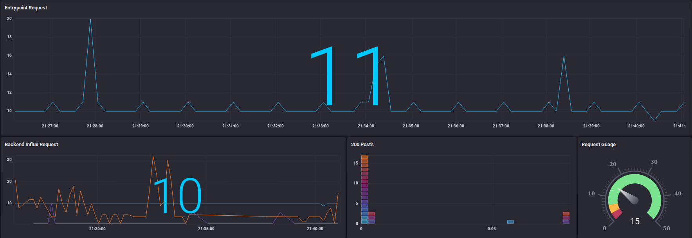

## Collection
For this I am testing out influxDB new 2.0-alpha release to collect metrics from traefik. The new version has way better graphs and abilites but the problem is that you cant write directly to the new influx without telegraf. So we have to generate a token for the new telegraf HTTP Listener v2 Input Plugin to relay the data.  

## Directions
```
docker network create proxy
docker-compose up -d traefik
docker-compose up -d influxdb
```
Visit http://influx.localhost for the interface.  
You will have to create a login, organization and bucket.  
When thats finished select expert to configure the rest later.  Select the tool on the left side menu and then token.  
Click on your name and copy that token along with replacing the other variables in the telegraf.conf file.  
_Hint: organization, bucket and token need to be the values you entered when logging into influxdb._  
```
[[outputs.influxdb_v2]]
  urls = ["http://influxdb:9999"]
  organization = "local"        
  bucket = "Traefik"
  token = "xxxxxxxxxxxxxxxxxxxxxxxxxxxxxxxxxxxxxxxxxxxxxxxxxxxxxxxxxx"  
```
Finally you can run:
```
docker-compose up -d telegraf
```

The listner port for telegraf has been moved to 8081 because it interfears with traefiks dashboard port.

_I am working on creating a Traefik Dashboard but if anyone comes up with something cool please share. :)_

